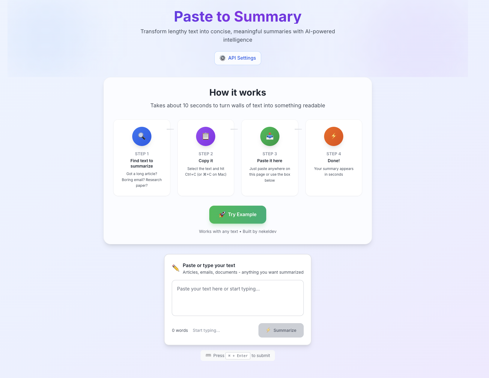
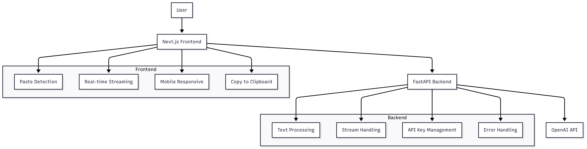

# Paste to Summary

A simple web app that turns long text into quick summaries using AI. Just paste your content and get the main points back in seconds.

## **🌐 Live at: [https://pastetosummary.com](https://pastetosummary.com)**



## What does it do?

Ever get stuck reading through endless emails, articles, or documents? This app takes that wall of text and gives you just the important stuff. Copy any text, paste it in, and watch it get summarized in real-time.

The "paste to" interaction pattern was inspired by [Paste to Markdown](https://euangoddard.github.io/clipboard2markdown/) - a brilliant little tool that converts copied content to markdown format.

## How it works



The app follows a clean architecture where the frontend never talks directly to the LLM - everything goes through our FastAPI backend. This gives us better control over requests, caching, and error handling.

## Tech Stack

**Frontend**

- Next.js 15 (React framework)
- TypeScript (because bugs are annoying)
- Tailwind CSS (for that clean look)
- Playwright (for testing across browsers)

**Backend**

- FastAPI (Python web framework)
- Server-side streaming (real-time text as it processes)
- OpenAI API integration
- Async request handling

**Infrastructure**

- AWS ECS (where it lives)
- Docker containers
- Nginx reverse proxy
- Custom domain with SSL

## Getting Started

### What you'll need

- Node.js 18+
- Python 3.12+
- OpenAI API key
- Docker (optional but recommended)

### Quick setup

1. **Clone and install**

   ```bash
   git clone https://github.com/yourusername/smart-summary-app.git
   cd smart-summary-app
   npm install
   ```

2. **Set up your environment**

   ```bash
   echo "OPENAI_API_KEY=your_key_here" > .env
   ```

3. **Run everything**
   ```bash
   npm run dev
   ```

That's it. Frontend runs on `http://localhost:3000`, backend on `http://localhost:8000`.

### Using Docker instead

If you prefer containers (and who doesn't):

```bash
docker-compose up --build
```

## Current Deployment Status

Right now, the app is running on AWS ECS. I deployed it manually using the AWS CLI because I wanted full control over the configuration. Here's what I set up:

- **AWS ECS cluster** running the containerized app
- **Custom domain** at `pastetosummary.com`
- **Nginx reverse proxy** running inside EC2 instances for SSL termination and load balancing
- **Manual deployment** via AWS CLI with custom task definitions

The setup works great, but it's not exactly CI/CD friendly. Every update requires manual intervention, which gets old fast.

## What's next?

I'm planning to modernize the deployment pipeline:

1. **Infrastructure as Code** - Convert everything to CloudFormation templates so deployments are reproducible
2. **GitHub Actions** - Set up automated CI/CD pipeline for testing and deployment
3. **ECS Integration** - Wire the automated pipeline directly into the existing ECS cluster
4. **Environment Management** - Separate staging and production environments properly

This will let me push code and have it automatically tested, built, and deployed without the manual AWS CLI dance.

## API Reference

### Core endpoints

**POST `/summarize/stream`**
Streams the summary back in real-time as it's being generated.

```bash
curl -X POST "http://localhost:8000/summarize/stream" \
     -H "Content-Type: application/json" \
     -d '{"text": "Your long text here...", "max_length": 200}'
```

**GET `/providers`**
Lists available LLM providers and their status.

**POST `/validate-api-key`**
Validates user-provided API keys.

**GET `/health`**
Health check endpoint for monitoring.

## Project Structure

```
smart-summary-app/
├── apps/
│   ├── frontend/           # Next.js app
│   │   ├── src/app/
│   │   │   ├── components/ # React components
│   │   │   ├── hooks/      # Custom hooks
│   │   │   ├── services/   # API calls
│   │   │   └── types/      # TypeScript definitions
│   │   ├── e2e/           # Playwright tests
│   │   └── package.json
│   └── backend/           # FastAPI app
│       ├── app/
│       │   ├── services/  # Business logic
│       │   ├── models.py  # Data models
│       │   └── main.py    # FastAPI setup
│       └── requirements.txt
├── docker-compose.yml     # Local development
└── README.md             # You're reading it
```

## Architecture Decisions

**Why FastAPI?** - It's fast, has great async support, and the automatic API docs are incredibly helpful during development.

**Why server-side streaming?** - Users see results immediately instead of waiting for the entire summary. Much better experience.

**Why Next.js?** - React with batteries included. The App Router makes routing simple, and the built-in optimizations are solid.

**Why separate frontend/backend?** - Clear separation of concerns. The frontend focuses on UI/UX, the backend handles LLM integration and business logic.

## Testing

The app has comprehensive testing across multiple levels:

**Unit Tests (Jest)**

```bash
npm run test
```

**End-to-End Tests (Playwright)**

```bash
npm run test:e2e
```

**Integration Tests**

```bash
npm run test:integration
```

The Playwright tests run across Chrome, Firefox, Safari, and mobile browsers to catch cross-platform issues.

## Security Considerations

- **API keys** are stored only in the browser, never sent to our servers
- **HTTPS everywhere** - all communication is encrypted
- **Input validation** prevents injection attacks
- **Rate limiting** protects against abuse
- **CORS** properly configured for the frontend domain

## Scaling Considerations

**Current setup** handles moderate traffic well, but here's how it could scale:

**Performance**

- Add Redis for caching frequent summaries
- Implement connection pooling for the database
- Use CDN for static assets
- Add horizontal scaling for backend services

**Monitoring**

- CloudWatch for AWS metrics
- Error tracking for debugging
- Performance monitoring for bottlenecks
- User analytics for product improvements

**Infrastructure**

- Auto-scaling groups for handling traffic spikes
- Multiple availability zones for redundancy
- Load balancers for distributing traffic
- Database clustering for high availability

## Future Ideas

Here are some features that could make this even better:

**Short term**

- Support for more LLM providers (Anthropic, Mistral, etc.)
- Custom summary lengths and styles
- Export summaries as PDF or markdown
- Browser extension for one-click summarization

**Long term**

- User accounts for saving summary history
- Collaborative features for team summarization
- API for third-party integrations
- Custom fine-tuned models for specific domains

## Contributing

Found a bug? Have an idea? Contributions are welcome!

1. Fork the repo
2. Create a feature branch: `git checkout -b my-feature`
3. Make your changes and add tests
4. Push and create a pull request

Make sure tests pass before submitting:

```bash
npm run test:ci
```

## License

MIT License - feel free to use this however you want.

---

Built by [nekeldev](https://patrick-nekel.vercel.app) | [LinkedIn](https://www.linkedin.com/in/nekelpatrick/) | [Buy me a coffee](https://www.buymeacoffee.com/nekeldev)
