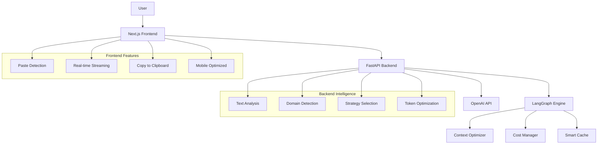

# Paste to Summary

Turn long, boring text into quick summaries. Just paste and wait.

**🌐 Live Demo: [https://pastetosummary.com](https://pastetosummary.com)**

## What it does

Got a wall of text? This thing makes it shorter. Paste in articles, emails, whatever - get the main points back in a few seconds.

## Architecture

The application follows a clean separation between frontend and backend, with server-side streaming for optimal user experience.



### Core Components

**Frontend (Next.js 15 + TypeScript)**

- Clean, responsive interface optimized for mobile
- Automatic paste detection anywhere on the page
- Real-time streaming of summary results
- Local storage for user preferences and API keys
- Smart caching system for instant re-summarization

**Backend (FastAPI + Python)**

- RESTful API with async/await for high performance
- Server-side streaming using OpenAI's streaming API
- Advanced LangGraph workflows for intelligent processing
- Context optimization and cost reduction strategies
- Comprehensive error handling and rate limiting

## Current Deployment

The application is currently running on AWS infrastructure with the following setup:

- **Platform**: AWS ECS (Elastic Container Service)
- **Deployment Method**: AWS CLI with custom task definitions
- **Domain**: Custom domain configured at `pastetosummary.com`
- **Reverse Proxy**: Nginx running inside EC2 instances
- **SSL**: Automatic HTTPS with proper certificate management

The deployment was done manually through AWS CLI, allowing for fine-grained control over the ECS cluster configuration. The current setup handles traffic efficiently and provides good performance for the summarization workloads.

## Planned Infrastructure Improvements

The next phase of development will focus on automating the deployment pipeline:

1. **Infrastructure as Code**: Migrate to CloudFormation templates for reproducible deployments
2. **CI/CD Pipeline**: Set up GitHub Actions for automated testing and deployment
3. **ECS Integration**: Wire the automated pipeline directly to the existing ECS cluster
4. **Environment Management**: Separate staging and production environments
5. **Monitoring**: Add CloudWatch dashboards and alerting

This will enable rapid iteration while maintaining the reliability of the current production setup.

## Features

### Basic stuff

- **Paste anywhere**: Drop text anywhere on the page or use the text box
- **Works with OpenAI**: Uses OpenAI's API (more providers coming)
- **Bring your own key**: Use your own API key if you want
- **Remembers stuff**: Caches up to 50 summaries so you don't re-process the same text
- **Try again**: Don't like the summary? Hit try again

### Smart features (experimental)

- **Picks the right approach**: Looks at your text and chooses how to process it
- **Knows content types**: Handles technical docs differently than news articles
- **Saves money**: Tries not to waste API calls
- **Shows confidence**: Tells you how sure it is about the summary

### Works everywhere

- **Mobile friendly**: Built for phones first
- **Keyboard shortcuts**: Cmd/Ctrl+V to paste, Cmd/Ctrl+Enter to go
- **Real-time**: Watch it write the summary
- **Accessible**: Works with screen readers and keyboard navigation

## Tech Stack

### Frontend

- **Framework**: Next.js 15 with App Router
- **Language**: TypeScript for type safety
- **Styling**: Tailwind CSS for responsive design
- **State Management**: React hooks with local storage persistence
- **Testing**: Jest + React Testing Library

### Backend

- **Framework**: FastAPI for the backend API
- **Language**: Python 3.12
- **AI Engine**: LangGraph for complex workflow orchestration
- **LLM Integration**: OpenAI API with streaming support
- **Caching**: In-memory cache with semantic similarity search
- **Testing**: Pytest with async support

### Infrastructure

- **Containerization**: Docker with multi-stage builds
- **Orchestration**: Docker Compose for local development
- **Cloud**: AWS ECS for production deployment
- **Reverse Proxy**: Nginx for SSL termination and load balancing

## Getting Started

### Prerequisites

- Node.js 18+ and npm
- Python 3.12+
- OpenAI API key
- Docker (optional, for containerized development)

### Quick Setup

1. **Clone the repository**

   ```bash
   git clone https://github.com/yourusername/smart-summary-app.git
   cd smart-summary-app
   ```

2. **Set up environment variables**

   ```bash
   echo "OPENAI_API_KEY=your_openai_api_key_here" > .env
   ```

3. **Install dependencies and start development servers**
   ```bash
   npm install
   npm run dev
   ```

The application will be available at:

- Frontend: http://localhost:3000
- Backend: http://localhost:8000

### Using Docker

For a containerized setup that mirrors production:

```bash
docker-compose up --build
```

## API Reference

### Core Endpoints

#### `POST /summarize/stream`

Streams summarization results in real-time.

**Request:**

```json
{
  "text": "Your long text here...",
  "max_length": 200,
  "api_key": "optional_user_api_key",
  "provider": "openai"
}
```

**Response:** Server-sent events stream

```
data: This is a summary
data: of your text that
data: streams in real-time.
data: [DONE]
```

#### `GET /providers`

Returns available LLM providers and their status.

#### `POST /validate-api-key`

Validates user-provided API keys.

### Advanced Features (v2 API)

#### `POST /v2/analyze`

Analyzes text complexity and provides optimization recommendations.

#### `GET /v2/analytics`

Returns usage analytics and cost optimization metrics.

## Project Structure

```
smart-summary-app/
├── apps/
│   ├── frontend/           # Next.js application
│   │   ├── src/
│   │   │   ├── app/
│   │   │   │   ├── components/     # React components
│   │   │   │   ├── hooks/          # Custom React hooks
│   │   │   │   ├── services/       # API services
│   │   │   │   └── types/          # TypeScript types
│   │   └── package.json
│   └── backend/            # FastAPI application
│       ├── app/
│       │   ├── services/           # Business logic
│       │   ├── models.py           # Pydantic models
│       │   └── main.py             # FastAPI app
│       └── requirements.txt
├── docker-compose.yml      # Development environment
├── deploy.sh              # Production deployment script
└── README.md              # This file
```

## Development Workflow

### Running Tests

**Frontend:**

```bash
cd apps/frontend
npm test
```

**Backend:**

```bash
cd apps/backend
python -m pytest
```

### Code Quality

The project uses ESLint for JavaScript/TypeScript and follows PEP 8 for Python. Pre-commit hooks ensure code quality before commits.

### Adding New Features

1. Create feature branch from `main`
2. Implement changes with tests
3. Ensure all tests pass
4. Submit pull request with description

## Scaling Considerations

### Performance Optimizations

- **Caching Strategy**: Intelligent caching reduces API calls by up to 80%
- **Connection Pooling**: Efficient database and API connection management
- **CDN Integration**: Static assets served via CloudFront
- **Lazy Loading**: Components and routes loaded on demand

### Horizontal Scaling

- **Stateless Design**: Backend services can be replicated without shared state
- **Load Balancing**: Nginx distributes traffic across multiple containers
- **Database Scaling**: Ready for managed database solutions (RDS, MongoDB Atlas)
- **Queue System**: Background processing for heavy workloads

### Monitoring and Observability

- **Health Checks**: Built-in health endpoints for container orchestration
- **Error Tracking**: Structured logging for debugging
- **Performance Metrics**: API response times and throughput monitoring
- **User Analytics**: Privacy-respecting usage statistics

## Security Measures

### Data Protection

- **API Key Security**: User keys stored only in browser, never on servers
- **HTTPS Everywhere**: All communication encrypted in transit
- **Input Validation**: Comprehensive validation prevents injection attacks
- **Rate Limiting**: Protects against abuse and DoS attacks

### Infrastructure Security

- **Container Security**: Regular security updates and minimal attack surface
- **Network Isolation**: Private subnets and security groups
- **Access Control**: IAM roles with least-privilege access
- **Secrets Management**: Environment variables and AWS Secrets Manager

## Future Roadmap

### Short Term (Next 3 months)

- **Multi-provider Support**: Add Anthropic Claude and Google Gemini
- **User Accounts**: Optional registration for history and preferences
- **Advanced Summarization**: Custom length, tone, and style options
- **Export Features**: PDF, Word, and Markdown export options

### Medium Term (6 months)

- **Collaborative Features**: Share summaries and collaborate on documents
- **API for Developers**: Public API for third-party integrations
- **Plugin Ecosystem**: Browser extensions and integrations
- **Analytics Dashboard**: Detailed usage and performance insights

### Long Term (1 year+)

- **Multi-language Support**: Summarization in different languages
- **Document Upload**: Support for PDF, Word, and other file formats
- **Custom Models**: Fine-tuned models for specific domains
- **Enterprise Features**: Team management and advanced security

## Contributing

We welcome contributions! Please see our contributing guidelines for details on how to:

- Report bugs
- Suggest features
- Submit pull requests
- Improve documentation

## License

This project is licensed under the MIT License. See the LICENSE file for details.

## Support

- **Documentation**: Check this README and inline code comments
- **Issues**: Report bugs or request features via GitHub Issues
- **Discussions**: Join community discussions in GitHub Discussions
- **Email**: Contact the maintainer directly for urgent issues

---

Built with ❤️ by [nekeldev](https://patrick-nekel.vercel.app) | [LinkedIn](https://www.linkedin.com/in/nekelpatrick/) | [Buy me a coffee](https://www.buymeacoffee.com/nekeldev)
